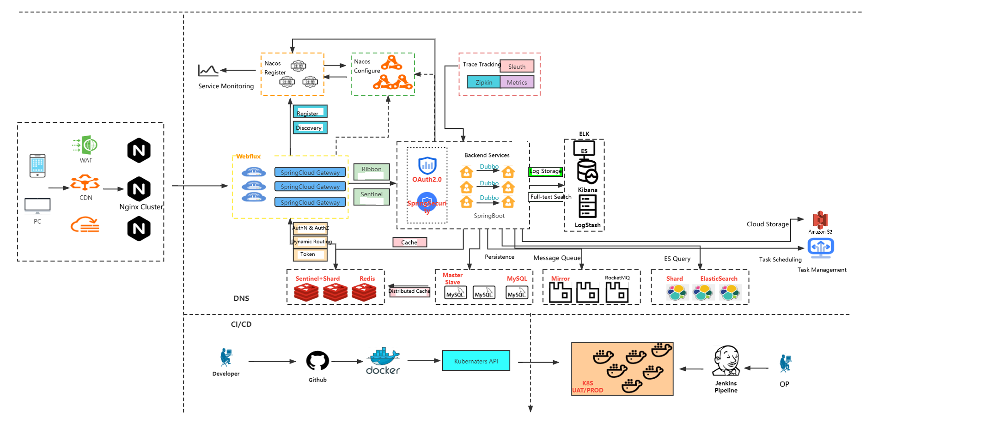
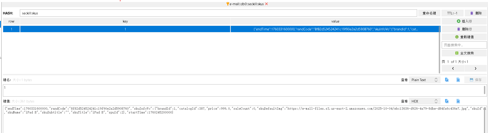

## A Distributed High-performance E-Commerce Platform

### Architecture

#### Front-end:

​	 VUE: Based on renren-fast-vue-master

​	Thymeleaf: Page Rendering		

#### Routing & Gateway:

​	Nginx

​	Spring Cloud Alibaba GateWay

​	Spring Cloud Alibaba Nacos

#### Back-end: 

​	renren-fast-master: (Info(product, ware, user) Management)

​	Spring Boot 2.x

​	Spring Cloud(Alibaba) 2021.x: OpenFeign ...

​	Seata

​	RocketMQ

#### DataBase:

​	MySQL

​	Redis

​	ElasticSearch(& Kibana)

​	MyBatis Plus 3.x(MySQL Manipulation Tool)

#### DevOps & Cloud:

​	Docker  

​	Sentinel

​	SkyWalking

​	AWS: EC2, S3        

### WorkFlow Demo

Promotion Activity (Able to handle visits in a short time and resolve high concurrency order problems)

